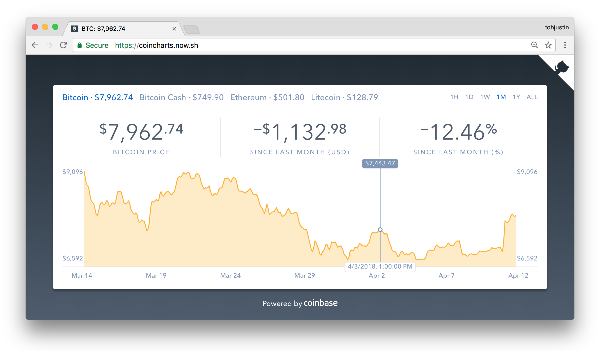

## About

[](https://circleci.com/gh/tohjustin/coincharts/tree/master)
[](https://codecov.io/gh/tohjustin/coincharts)
[](https://github.com/tohjustin/coincharts/releases)
[](https://opensource.org/licenses/MIT)

Coincharts is a cryptocurrency price chart based off [Coinbase](https://www.coinbase.com/)'s original price chart on [https://www.coinbase.com/charts](https://web.archive.org/web/20190331085909/https://www.coinbase.com/charts)

<p align="center">
  
</p>

* Bootstrapped with [create-react-app](https://github.com/facebook/create-react-app)
* Built with [React.js](https://reactjs.org/), [Redux](https://redux.js.org/)\*\*, [Redux-Saga](https://redux-saga.js.org/)\*\*, [styled-components](https://www.styled-components.com/), [D3.js](https://d3js.org/)
* Prices retrieved from [Coinbase API](https://developers.coinbase.com/api/v2)
* Deployed with [ZIET Now](https://zeit.co/home)
* Error logging with [Sentry + Raven.js](https://github.com/getsentry/sentry-javascript)
* Optional page-view tracking with [Google Analytics + react-ga](https://github.com/react-ga/react-ga)

_\*\* [Redux](https://redux.js.org/), [Redux-Saga](https://redux-saga.js.org/) is used for learning purposes (slight overkill for this simple app)_

## Getting Started

Start the application's `webpack-dev-server`

```shell
yarn start
```

### Linting & Testing

#### Linting

Run [ESLint](https://eslint.org/) & [Prettier](https://prettier.io/)

```shell
yarn run check
```

Fix [ESLint](https://eslint.org/) all fixable errors & warnings

```shell
yarn lint:fix
```

Fix [Prettier](https://prettier.io/) all fixable errors & warnings

```shell
yarn prettier:fix
```

#### Unit Testing

Run all unit tests & watch for changes

```shell
yarn test
```

Run all unit tests & enable [Node Debugger](https://nodejs.org/docs/latest-v12.x/api/debugger.html)

```shell
yarn test:debug
```

Run all unit tests & generate test coverage

```shell
yarn test:ci
```

### Packaging

> __NOTE__: Make sure you have updated `.env.build` before proceeding

Create a production build of the application & output the bundle into `/build`

```shell
yarn build
```

### Scripts

#### Deploy application with __ZIET Now__

> __NOTE__: Make sure you have created `.env` & updated `now.json` before proceeding
>
> * see [.env.example](./.env.example) for list of environment variables to populate
> * see [https://zeit.co/docs/configuration](https://zeit.co/docs/configuration) for list of configs to populate

```shell
yarn script:deploy
```

#### Downloading API data

Takes a snapshot of responses from coinbase API & saves them into JSON files in `public/priceData` used for offline development

```shell
yarn script:downloadPriceData
```

## License

Coincharts is [MIT licensed](./LICENSE).

[](https://app.fossa.com/projects/git%2Bgithub.com%2Ftohjustin%2Fcoincharts?ref=badge_large)
